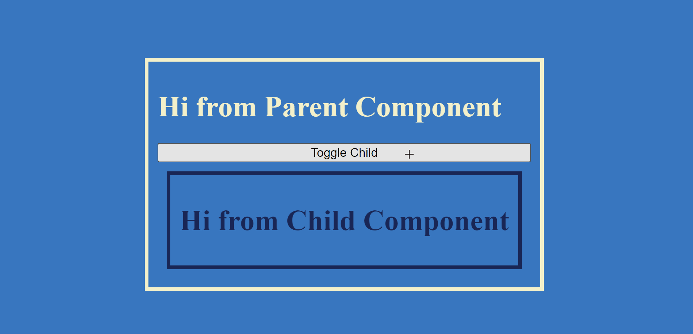

# 1. Special Angular CSS Selectors

Special CSS selectors for Angular components.

- [1. Special Angular CSS Selectors](#1-special-angular-css-selectors)
  - [1.1. :host](#11-host)
    - [1.1.1. Parent Component](#111-parent-component)
  - [1.2. :host-deep](#12-host-deep)
    - [1.2.1. Parent Component](#121-parent-component)
    - [1.2.2. Problems](#122-problems)
  - [1.3. :host-context](#13-host-context)
    - [1.3.1. Parent Component Template](#131-parent-component-template)
    - [1.3.2. Child Component Styles](#132-child-component-styles)

## 1.1. :host

Used for applying styles to the component itself. Every component has a host element, and styles in `:host` selector will apply to that host element and it's children in the *component's template only.* ***Note:*** *The child components will not inherit these styles thereby respecting **View Encapsulation**.*

<div style="text-align:center">

</div>

### 1.1.1. Parent Component

```css
:host h1 {
  color: #F3F0CA;
}
```

## 1.2. :host-deep

Used for applying styles to all children *including child components.* **Note:** *This is deprecated and will be removed in future versions of Angular.*

<div style="text-align:center">

</div>

### 1.2.1. Parent Component

```css
:host ::ng-deep h1 {
  color: #F3F0CA;
}
```

### 1.2.2. Problems

- Violates the idea of `View Encapsulation`, which is to treat a components styles as private properties of the component, by affecting the styles of child components using `:ng-deep` selector this notion is violated.
- `View Encapsulation` ensures that a component styles itself regardless of where it's rendered in the DOM.

## 1.3. :host-context

Used for applying styles to a component based on the context. The ancestor component must have a class or attribute that can be used to target it from the child component. ***Note:*** *Here `View Encapsulation` is not applicable as the styles are applied based on the context.*

<div style="text-align:center">

</div>

### 1.3.1. Parent Component Template

```html
<h1>Hi from Parent Component</h1>
<button (click)="toggleChildVisibility()">Toggle Child</button>
<app-child [class.show-child]="isChildVisible"></app-child>
```

### 1.3.2. Child Component Styles

```css
:host {
  border: 4px solid #192655;
  padding: 10px;
  display: none;
  margin: 10px;
  color: #192655;
}

:host-context(.show-child) {
  display: block;
}
```
