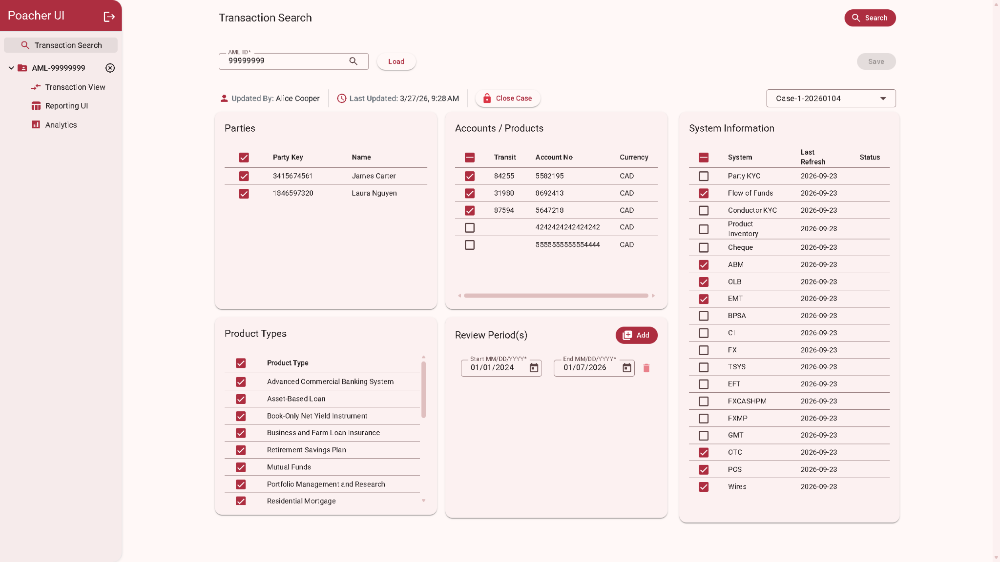
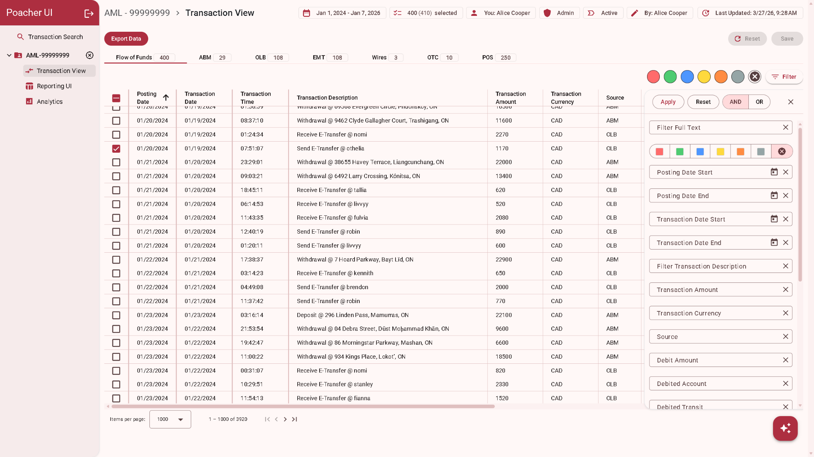
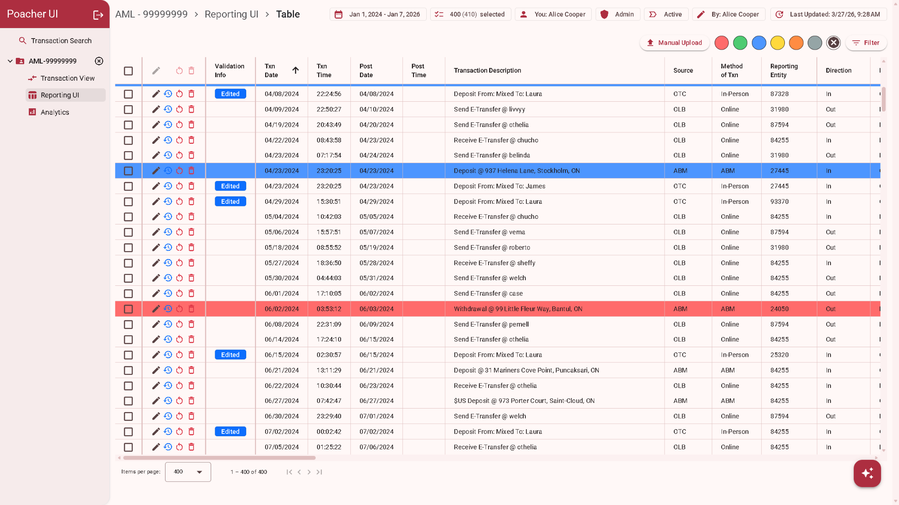
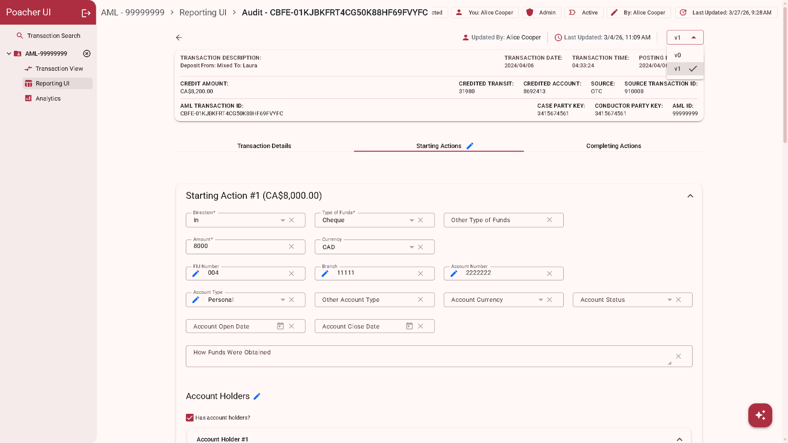
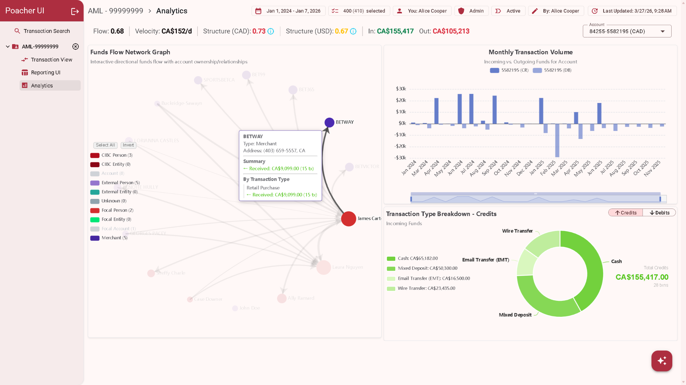

# Poacher UI

**An Angular application for suspicious transaction reporting, built with a full-stack focus on auditability, collaboration, and data integrity.**

Poacher UI brings transaction search, investigation, editing, and reporting into one case workspace. Users can select transactions from multiple sources, enrich reporting data, inspect historical changes, and explore the movement of funds through interactive analytics.

I built the project across **Angular, TypeScript, RxJS, .NET, and MongoDB**, with particular attention to the frontend challenges of complex forms, dense data tables, reactive state, and reliable asynchronous workflows.

**Frontend highlights:** reusable table and form architecture · Signals and RxJS · OnPush change detection · lazy loading · interactive data visualization

**Full-stack highlights:** JWT authentication and RBAC · ETag optimistic concurrency · automatic refresh on HTTP 409 conflicts · versioned change logs · TLS-enabled database connections · Docker deployment

- [Poacher UI](#poacher-ui)
  - [Product walkthrough](#product-walkthrough)
    - [1. Define the investigation — Transaction Search](#1-define-the-investigation--transaction-search)
    - [2. Find relevant activity — Transaction View](#2-find-relevant-activity--transaction-view)
    - [3. Prepare report data — Reporting UI](#3-prepare-report-data--reporting-ui)
    - [4. Explain every change — Audit and Version History](#4-explain-every-change--audit-and-version-history)
    - [5. Understand the activity — Analytics](#5-understand-the-activity--analytics)
  - [Angular engineering practices](#angular-engineering-practices)
  - [Advanced Javascript - Event Loop Async Scheduling](#advanced-javascript---event-loop-async-scheduling)
  - [Collaboration without silent overwrites](#collaboration-without-silent-overwrites)
  - [Security and full-stack design](#security-and-full-stack-design)
  - [Technology stack](#technology-stack)
  - [Testing and development](#testing-and-development)
  - [Author](#author)
  - [MongoDB Storage Details](#mongodb-storage-details)
  - [Suspicious Transaction Reporting (STR) Model Schema](#suspicious-transaction-reporting-str-model-schema)
    - [Usage Notes](#usage-notes)
    - [General Subject (sub)](#general-subject-sub)
    - [Personal Subject with Structured Address (subPersonStrucAddress)](#personal-subject-with-structured-address-subpersonstrucaddress)
    - [Personal Subject with Unstructured Address (subPersonUnstrucAddress)](#personal-subject-with-unstructured-address-subpersonunstrucaddress)
    - [Entity Subject with Structured Address (subEntityStrucAddress)](#entity-subject-with-structured-address-subentitystrucaddress)
    - [Entity Subject with Unstructured Address (subEntityUnstrucAddress)](#entity-subject-with-unstructured-address-subentityunstrucaddress)
    - [Transaction Schema (strTxn)](#transaction-schema-strtxn)
    - [Starting Action Schema (startingAction)](#starting-action-schema-startingaction)
    - [Completing Action Schema (completingAction)](#completing-action-schema-completingaction)
    - [Conductor Schema (conductor and conductorWithNpd)](#conductor-schema-conductor-and-conductorwithnpd)
    - [Basic Conductor](#basic-conductor)
    - [Conductor with Non-Personal Device Details (conductorWithNpd)](#conductor-with-non-personal-device-details-conductorwithnpd)
    - [Beneficiary Schema (beneficiary)](#beneficiary-schema-beneficiary)
    - [Account Holder Schema (accountHolder)](#account-holder-schema-accountholder)
  - [Mock Data Identifiers](#mock-data-identifiers)

## Product walkthrough

### 1. Define the investigation — Transaction Search



Build a search around an AML case, selected parties, accounts, product types, source systems, and multiple review periods. The workspace shows who last updated the case, when it changed, and whether it is active or closed.

- Selectable tables integrate with reactive forms through custom `ControlValueAccessor` implementations.
- Party and account details load through API services, with skeleton states while data is fetched.
- Search progress and source status provide feedback during asynchronous requests.
- A deterministic search-criteria hash detects when inputs have changed since the last search; warning indicators help users recognize stale results.
- Dangling selections can be identified and cleared when they no longer appear in the current result set.

### 2. Find relevant activity — Transaction View



Explore flow-of-funds records and source-specific transactions across ABM, online banking, e-transfers, wires, over-the-counter activity, and point-of-sale transactions.

- Combine text, date, selection, and highlight filters using **AND/OR** logic.
- Sort, paginate, export, and select records for the reporting workspace.
- Use multi-row selection and colour highlighting to organize review work.
- Navigate dense datasets with sticky headers, configurable column widths, horizontal overflow handling, and virtual scrolling.
- Preserve navigation context through route reuse and scroll-position restoration.

The table system shares filtering, selection, sorting, and highlighting behaviour across source views, while content projection supports specialized columns.

### 3. Prepare report data — Reporting UI



Turn selected transactions into structured STR data. Review individual records, apply bulk changes, import manual transactions, and resolve validation issues within the same workspace.

- Single-record and bulk edits use a shared queued save pipeline.
- Validation badges surface edited records and missing transaction, conductor, beneficiary, or banking information.
- Dynamic validators and dependent-field controls support complex reporting requirements.
- Manual uploads include a review table before persistence.
- Per-transaction saving state provides focused feedback during updates.
- Closed cases disable editing actions, backed by API-side closed-case guards.

### 4. Explain every change — Audit and Version History



Inspect earlier transaction versions through the same structured form interface used for reporting. Version-specific author and timestamp metadata, together with field-level change indicators, make the history easier to review.

The change-log system tracks nested fields and array operations, including additions, updates, and removals. Reusable editable and auditable form components keep editing and historical inspection consistent.

The project evolved from versioned session storage into **persistent case records and transaction selections**. Versioned change tracking remains central to the workflow, supporting traceability without requiring users to coordinate edits manually.

### 5. Understand the activity — Analytics



Interactive ECharts visualizations connect individual transactions to the broader investigation:

- **Funds-flow network:** directional relationships between people, entities, accounts, and merchants, with contextual details and transaction summaries.
- **Monthly transaction volume:** incoming and outgoing funds for a selected account, with review-period zoom controls.
- **Transaction-type breakdown:** credit and debit composition, totals, and multi-currency formatting.
- **Review indicators:** flow-through, funds-movement velocity, and per-currency structuring ratios, with threshold context in tooltips.

These indicators support investigation and interpretation; they are not automated determinations of suspicious activity.

An additional narrative-assistant interface uses Hashbrown and a streaming chat endpoint, with application tools for transaction context and basic-information checks.

## Angular engineering practices

| Practice                     | Implementation and purpose                                                                                                                                                                  |
| ---------------------------- | ------------------------------------------------------------------------------------------------------------------------------------------------------------------------------------------- |
| Reusable components          | Generic base tables, projected columns, and shared editable/auditable forms reduce duplication across transaction sources.                                                                  |
| Reactive state               | `CaseRecordStore` coordinates case data, selections, and ETags through RxJS; Angular Signals manage authentication state and row highlights.                                                |
| Efficient rendering          | OnPush change detection, immutable updates, and signal-backed highlight maps avoid unnecessary data-source remapping and sorting. Highlight-only saves suppress unrelated table re-renders. |
| Composable forms             | Typed reactive forms, custom `ControlValueAccessor` controls, shared validators, and reusable directives encapsulate complex input behaviour.                                               |
| Predictable async work       | Queued updates coordinate edits; `exhaustMap` controls save submissions; targeted `take(1)` usage prevents unintended re-emissions.                                                         |
| Lifecycle and error handling | `DestroyRef` cleanup, RxJS lint rules, stream error boundaries, and a global snackbar error handler support maintainable asynchronous flows.                                                |
| Deliberate lazy loading      | Analytics, manual upload, and edit-form features use lazy loading. ESLint import restrictions keep ECharts and spreadsheet dependencies out of unintended eager paths.                      |
| Scoped dependencies          | AML route providers scope case-related services and AI/Markdown dependencies to the relevant workflow.                                                                                      |
| Consistent visual design     | Angular Material/CDK, Material 3 colour tokens, SCSS utilities, compact spacing, and shared loading states create a consistent workspace.                                                   |
| Navigation continuity        | Nested routes, resolvers, route caching, and scroll restoration preserve context; case closure includes route-cache eviction and navigation cleanup.                                        |

Additional state safeguards include cloning nested form data to prevent cross-transaction mutations, normalizing empty values during change detection, cached filter-option computation, shared replay caching for reference data, and IndexedDB persistence for local highlights.

## Advanced Javascript - Event Loop Async Scheduling

Form interactions can trigger multiple synchronous emissions as related form values and reactive state are updated. Processing every intermediate emission can cause unnecessary recalculations when only the latest state is relevant.

debounceTime(0) creates an asynchronous boundary in the reactive pipeline. Synchronous emissions produced during the current call stack are coalesced, and only the latest pending value is emitted during later scheduled event-loop work.

```js
filteredSelectionsByAccountAndPeriod$ = combineLatest([
  this.filteredSelectionsByAccount$,
  this.filterForm.valueChanges,
]).pipe(
  debounceTime(0),
  map(...)
);
```

[Source](https://github.com/sduzair/Angular/blob/24048995f8c3e4f66f5c07c042af7aa932b06b54/user-reporting-app/src/app/analytics/analytics.component.ts#L369)

## Collaboration without silent overwrites

Poacher UI combines **optimistic UI updates** for responsive interaction with **optimistic concurrency control** for persistence safety.

1. The frontend loads case and selection data and tracks the corresponding **ETags**.
2. A user edits a record or changes selections. The shared update pipeline derives pending changes and tracks saving state.
3. The API validates the supplied version before accepting an update, selection change, or bulk save.
4. If another user has already changed the data, the application handles **HTTP 409 Conflict**, refreshes from the server, and applies conflict rollback handling so the UI can recover from stale state.
5. Accepted edits become part of the versioned history, with update metadata available in the interface.

This supports concurrent work while preventing stale writes from silently replacing newer changes. Conflict refresh is a recovery mechanism; it does not imply automatic merging of competing edits.

## Security and full-stack design

| Area                      | Implementation                                                                                                                                                                                              |
| ------------------------- | ----------------------------------------------------------------------------------------------------------------------------------------------------------------------------------------------------------- |
| Authentication            | JWT bearer authentication across the Angular app and API. An Angular HTTP interceptor attaches tokens and redirects on unauthorized responses.                                                              |
| Role-based access control | Additive Analyst, Investigator, and Admin policies enforce API authorization. The UI exposes role context and gates close/reopen actions to Investigator/Admin users.                                       |
| Case lifecycle            | Close and reactivate endpoints use ETag checks. Closed-state guards protect update, add, save, reset, and related operations.                                                                               |
| API and persistence       | A .NET API stores case records, selections, entities, and change history in MongoDB. Transactional operations protect related selection/entity writes.                                                      |
| Search                    | A POST search endpoint accepts structured criteria and streams transaction-search responses for large datasets.                                                                                             |
| Data consistency          | Deterministic entity hashing, case-scoped uniqueness constraints, cross-case validation, and search-criteria hashing support consistent records.                                                            |
| TLS encryption            | API-to-MongoDB connections support TLS, with documented CA, server, and client certificate setup and MongoDB Atlas TLS configuration.                                                                       |
| Deployment                | Multi-stage Angular/.NET Docker builds, Docker Compose database seeding, and Render deployment configuration. Runtime decoding supports PEM client certificates supplied through environment configuration. |

## Technology stack

| Layer                | Technologies                                                                                  |
| -------------------- | --------------------------------------------------------------------------------------------- |
| Frontend             | Angular 21.1, TypeScript 5.9, RxJS 7.8, Angular Signals                                       |
| UI and forms         | Angular Material/CDK 21.1, reactive forms, SCSS, Bootstrap 5.3, date-fns                      |
| Visualization        | Apache ECharts 6                                                                              |
| Data utilities       | IndexedDB via `idb`, XLSX, JSON canonicalization, ULID                                        |
| AI interface         | Hashbrown, Google provider integration, Markdown rendering                                    |
| Backend and storage  | .NET, MongoDB, JWT, ETags                                                                     |
| Delivery and quality | Docker, Render configuration, pnpm 9.8, ESLint, Prettier, Jasmine, Karma, source-map-explorer |

## Testing and development

The Git history includes frontend tests for change-log behaviour, nested array operations, form validation, bulk edits, and manual transaction building. Angular Material form harnesses and isolated fixtures support UI testing.

API integration tests cover transactional integrity, ETag mismatches, case closure/reactivation, closed-case guards, entity uniqueness, cross-case validation, and search behaviour.

From the Angular application directory, the supplied package scripts support:

```bash
pnpm install
pnpm start              # Angular development server
pnpm build              # Build the application
pnpm test              # Interactive frontend tests
pnpm test:ci           # Headless Chrome test run
pnpm lint              # Angular, TypeScript, and RxJS lint rules
pnpm format:check      # Check formatting
pnpm analyze-bundle    # Inspect JavaScript bundle composition
```

The complete workflow also requires the .NET API, MongoDB, and the project's environment, proxy, authentication, and certificate configuration.

<details>
<summary><strong>Selected engineering milestones from the Git history</strong></summary>

| Commit    | Milestone                                                                                           |
| --------- | --------------------------------------------------------------------------------------------------- |
| `1a4280a` | Reusable transaction tables with advanced filters, selection, highlighting, and Material 3 theming. |
| `d148544` | Queued single/bulk edits, optimistic local updates, versioned change logs, and conflict handling.   |
| `fbafc76` | Persistent case records, ETag concurrency, streaming search, and transactional integration tests.   |
| `091adba` | Automatic data refresh on 409 conflicts and dedicated selection services.                           |
| `919ce8c` | Lazy-route isolation for ECharts and scoped AI/Markdown providers.                                  |
| `363ecf0` | Signal-based highlight state to avoid full table remapping and sorting.                             |
| `8bf4b65` | Shared editable/auditable form components and visual audit change indicators.                       |
| `18ba907` | JWT authentication and additive RBAC policies across the API and frontend.                          |
| `a0fcffb` | TLS-enabled MongoDB/API containers and certificate configuration.                                   |

</details>

## Author

**Uzair Syed** — Frontend developer with versatile full-stack experience.

[LinkedIn](https://www.linkedin.com/in/uzair-syed-91681211a) · [GitHub](https://github.com/sduzair)

## MongoDB Storage Details

| Item            | Description                                  |
| --------------- | -------------------------------------------- |
| **Database**    | `strTxnDB`                                   |
| **Collections** |                                              |
| `strTxns`       | Stores suspicious transaction documents      |
| `subjects`      | Stores subject (individual/entity) documents |
| `sessions`      | Stores session-related data                  |

## Suspicious Transaction Reporting (STR) Model Schema

This document provides an overview and explanation of the schema used for modeling Suspicious Transaction Reporting (STR) data.

### Usage Notes

- The model supports multiple starting and completing actions per transaction.
- The linkToSub field connects related parties across different parts of the schema.
- Use the appropriate subject schema depending on whether the subject is a person or entity and whether the address is structured or unstructured.

### General Subject (sub)

```json
{
  "subType": null,
  "_hiddenSurname": null,
  "_hiddenGivenName": null,
  "otherName": null,
  "_hiddenPartyKey": null,
  "_hiddenNameOfEntity": null,
  "telephoneNo": null,
  "addressType": "structured",
  "strucUnitNo": null,
  "strucHouseNo": null,
  "strucStAddress": null,
  "strucCity": null,
  "strucDistrict": null,
  "strucPostalCode": null,
  "strucCountry": null,
  "strucProvince": null,
  "strucSubProvince": null,
  "unstrucAddDetails": null,
  "unstrucCountry": null
}
```

### Personal Subject with Structured Address (subPersonStrucAddress)

```json
{
  "subType": "personal",
  "_hiddenSurname": null,
  "_hiddenGivenName": null,
  "otherName": null,
  "_hiddenPartyKey": null,
  "addressType": "structured",
  "strucUnitNo": null,
  "strucHouseNo": null,
  "strucStAddress": null,
  "strucCity": null,
  "strucDistrict": null,
  "strucPostalCode": null,
  "strucCountry": null,
  "strucProvince": null,
  "strucSubProvince": null
}
```

### Personal Subject with Unstructured Address (subPersonUnstrucAddress)

```json
{
  "subType": "personal",
  "_hiddenSurname": null,
  "_hiddenGivenName": null,
  "otherName": null,
  "_hiddenPartyKey": null,
  "addressType": "unstructured",
  "unstrucAddDetails": null,
  "unstrucCountry": null
}
```

### Entity Subject with Structured Address (subEntityStrucAddress)

```json
{
  "subType": "entity",
  "_hiddenPartyKey": null,
  "_hiddenNameOfEntity": null,
  "telephoneNo": null,
  "addressType": "structured",
  "strucUnitNo": null,
  "strucHouseNo": null,
  "strucStAddress": null,
  "strucCity": null,
  "strucDistrict": null,
  "strucPostalCode": null,
  "strucCountry": null,
  "strucProvince": null,
  "strucSubProvince": null
}
```

### Entity Subject with Unstructured Address (subEntityUnstrucAddress)

```json
{
  "subType": "entity",
  "_hiddenPartyKey": null,
  "_hiddenNameOfEntity": null,
  "telephoneNo": null,
  "addressType": "unstructured",
  "unstrucAddDetails": null,
  "unstrucCountry": null
}
```

### Transaction Schema (strTxn)

```json
{
  "wasTxnAttempted": false,
  "wasTxnAttemptedReason": null,
  "dateOfTxn": null,
  "timeOfTxn": null,
  "hasPostingDate": false,
  "dateOfPosting": null,
  "timeOfPosting": null,
  "methodOfTxn": null,
  // "hasMethodOfTxnOther": false, note: use 'Other' option on method of txn dropdown
  "methodOfTxnOther": null,
  "reportingEntityTxnRefNo": null,
  "purposeOfTxn": null,
  "reportingEntityLocationNo": null,
  "startingActions": [],
  "completingActions": []
}
```

### Starting Action Schema (startingAction)

```json
{
  "directionOfSA": null,
  "typeOfFunds": null,
  "typeOfFundsOther": null,
  "amount": null,
  "currency": null,
  "fiuNo": null,
  "branch": null,
  "account": null,
  "accountType": null,
  "accountTypeOther": null,
  "accountOpen": null,
  "accountClose": null,
  "accountStatus": null,
  "howFundsObtained": null,
  "accountCurrency": null,
  "accountHolders": [],
  "wasSofInfoObtained": null,
  "sourceOfFunds": [],
  "wasCondInfoObtained": null,
  "conductors": []
}
```

### Completing Action Schema (completingAction)

```json
{
  "detailsOfDispo": null,
  "detailsOfDispoOther": null,
  "amount": null,
  "currency": null,
  "exchangeRate": null,
  "valueInCad": null,
  "fiuNo": null,
  "branch": null,
  "account": null,
  "accountType": null,
  "accountTypeOther": null,
  "accountCurrency": null,
  "accountOpen": null,
  "accountClose": null,
  "accountStatus": null,
  "accountHolders": [],
  "wasAnyOtherSubInvolved": null,
  "involvedIn": [],
  "wasBenInfoObtained": null,
  "beneficiaries": []
}
```

### Conductor Schema (conductor and conductorWithNpd)

### Basic Conductor

```json
{
  "linkToSub": null,
  "clientNo": null,
  "email": null,
  "url": null,
  "wasConductedOnBehalf": null,
  "onBehalfOf": []
}
```

### Conductor with Non-Personal Device Details (conductorWithNpd)

```json
{
  "linkToSub": null,
  "clientNo": null,
  "email": null,
  "url": null,
  "wasConductedOnBehalf": null,
  "onBehalfOf": [],
  "npdTypeOfDevice": null,
  "npdTypeOfDeviceOther": null,
  "npdDeviceIdNo": null,
  "npdUsername": null,
  "npdIp": null,
  "npdDateTimeSession": null,
  "npdTimeZone": null
}
```

Extends the basic conductor with device-related metadata such as device type, IP address, and session time

### Beneficiary Schema (beneficiary)

```json
{
  "linkToSub": null,
  "clientNo": null,
  "email": null,
  "url": null
}
```

### Account Holder Schema (accountHolder)

```json
{
  "linkToSub": null
}
```

## Mock Data Identifiers

Focal Clients:

- 78b7022a-5fc4-4495-9dca-7b50c6c4e8b0
- 0ba7dc99-5ae0-40c5-96d3-12a08d798eac

Accounts/Products:

- transit: 84255, 31980, 87594
- account: 5582195, 8692413, 5647218
- type: Personal, Business, Trust
- open: 2003/08/24, 2001/07/14, 2005/06/23
- close: null, 2017/12/11, null

Session ID: 6860df310a7abaeb4bd24fab
